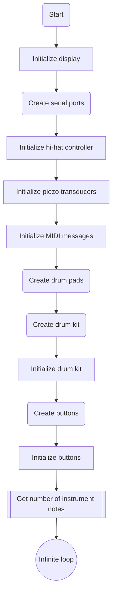
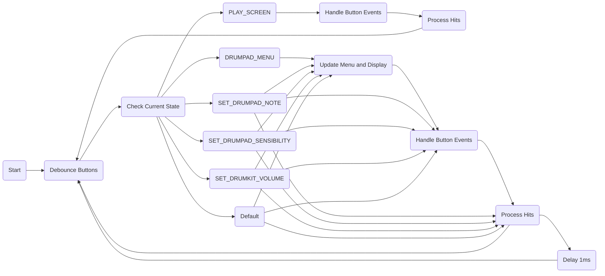
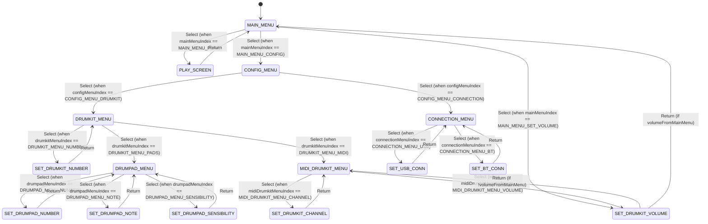
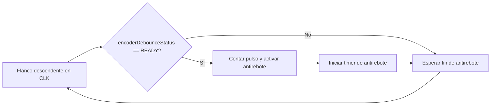
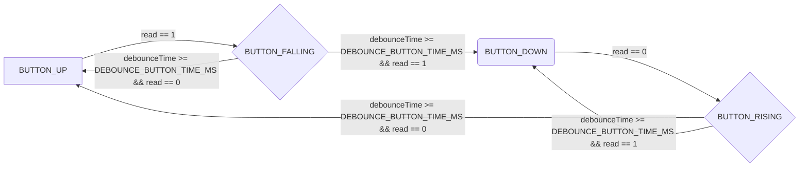

## Memoria de Trabajo Final:
# MIDI Drum Kit

## Autor:
# Ing. Ian Lesnianski

# Resumen
Este trabajo presenta el desarrollo de un instrumento de percusión electrónico. El sistema embebido captura acciones musicales mediante drum pads equipados con transductores piezoeléctricos, los cuales convierten los golpes en señales eléctricas. Estas señales se procesan y transforman en mensajes MIDI (Musical Instrument Digital Interface) que se transmiten a una computadora, donde son interpretados y enviados a una estación de audio digital (DAW) para generar el sonido del instrumento.

El sistema también incluye una interfaz de usuario con pantalla gráfica, encoder rotativo y pulsadores, que permiten configurar el drumkit de manera intuitiva, además de un pedal de control para el hi-hat.

Este desarrollo integra hardware y software para crear un dispositivo funcional, enfocado en la producción musical.

# CAPÍTULO 1
## Introducción general
### Descripción
El presente trabajo consiste en el desarrollo de un sistema electrónico orientado a la captura y procesamiento de acciones musicales mediante transductores piezoeléctricos integrados en drum pads. Estos transductores convierten la deformación mecánica generada por golpes en señales eléctricas, que luego son procesadas y transformadas en mensajes MIDI, siguiendo el estándar de este protocolo ampliamente utilizado en la industria musical.

La transmisión de los mensajes MIDI hacia una computadora se llevó a cabo utilizando dos opciones de comunicación: una interfaz UART o una conexión Bluetooth. Los mensajes recibidos en el puerto COM de la PC son interpretados por el software Hairless-MIDI, que reenvía estos datos a un puerto MIDI de salida virtual, creado mediante el uso del software loopMIDI. Esto permite la interacción con una Estación de Audio Digital (DAW, por sus siglas en inglés), en este caso Reaper, que fue utilizada para generar el sonido del instrumento.

El desarrollo de este sistema involucró la captura y procesamiento de señales musicales, como también la implementación de una interfaz de usuario para facilitar la configuración de distintos atributos del instrumento. Dicha interfaz incluyó un display gráfico LCD, un encoder rotativo y dos pulsadores, que permiten al usuario navegar por los menús del sistema y ajustar las configuraciones según sus necesidades. Asimismo, se añadió un pedal de control de hi-hat, mejorando la capacidad del dispositivo para emular el comportamiento de un set de batería tradicional, brindando una experiencia más realista en la ejecución musical.

Desde una perspectiva práctica, el sistema ofrece una aplicación directa en el ámbito de la recreación musical, permitiendo al usuario personalizar su set de drum pads y controlar los sonidos generados en tiempo real, lo que lo convierte en una herramienta de gran valor para el entretenimiento y la creación musical. Asimismo, este proyecto se destaca por ser una variante económica frente a los productos comerciales existentes en el mercado, ofreciendo una alternativa accesible y funcional.

### Diagrama en bloques del sistema

### Estado del arte

Para establecer un punto de referencia, se compararon características de productos similares ofrecidos por marcas líderes en el mercado, como Alesis, Roland y Yamaha. Cabe destacar que el objetivo de este desarrollo no fué superar las prestaciones de los productos mencionados, si no tomar sus características como referencias para el diseño.
El  foco del trabajo fué lograr una versión económica que incluyera las prestaciónes básicas de este tipo de productos.

Marca | Alesis        | Roland | Yamaha       | 
------|---------------|--------|------------- |
Modelo| SamplePad Pro | SPD-SX | DTX Multi 12 |

Caracteristica         | SamplePad Pro           | SPD-SX                       | DTX-MULTI 12          |
-----------------------|-------------------------|------------------------------|-----------------------|
Cantidad de pads       | 8                       | 9                            | 12                    | 
Iluminación reactiva   | SI                      | SI                           | NO                    |
Control de Hi-hat      | SI                      | SI                           | SI                    |
Pedal de bombo         | SI                      | SI                           | SI                    |
MIDI in                | SI                      | SI                           | SI                    |
MIDI out               | SI                      | SI                           | SI                    |
Polifonía              | --                      | 20 voces                     | 64 voces              |
Pads dinámicos         | SI                      | SI                           | SI                    |
Memoria disponible     | SD/SDHC card externa    | 2GB                          | 168MB                 |
USB-MIDI               | SI                      | SI                           | SI                    |
Presets                | 200                     | 100                          | 50                    |
Display                | LCD Gráfico 128x64 dots | LCD Gráfico 128x64 dots      | LCD 16x2              |
SD Card Slot           | SI                      | NO                           | NO                    |
Fuente de alimentación | DC 9V                   | DC 9V                        | DC 12V                |
Precio                 | $ 1.600.000             | $2.200.500                   | $1.800.000            |

Links:
* [Alesis-SamplePad Pro](https://www.alesis.com/products/view2/samplepad-pro.html)
* [Roland-SPD-SX](https://www.roland.com/LATINAMERICA/products/spd-sx/)
* [Yamaha-DTX-MULTI 12](https://es.yamaha.com/es/products/musical_instruments/drums/el_drums/drum_kits/dtx_multi_pad/features.html)

A partir del análisis de las características de estos productos comerciales, se determinaron las funcionalidades esenciales del dispositivo, tomando en cuenta los conocimientos adquiridos a lo largo del curso, las limitaciones del hardware disponible y su accesibilidad. Como resultado, se desarrolló un sistema compuesto por tres pads, con prestaciones similares a las de un kit básico de batería, que incluye capacidad de comunicación inalámbrica, interfaz de usuario y sonidos configurables.

# CAPÍTULO 2
## Introducción específica
### Requisitos

A continuación se detallan los requisitos iniciales establecidos para el trabajo final en concordancia con los criterios SMART (Specific, Measurable, Achievable, Relevant, Time-bound). Estos requisitos fueron felizmente logrados en el desarrollo.

Grupo de requisito     | ID  | Descripción                                                                                                                                                                                                 |
-----------------------|-----|-------------------------------------------------------------------------------------------------------------------------------------------------------------------------------------------------------------|   
1.Sensado              | 1.1 | El sistema tendrá sensibilidad a los golpes sobre los 3 drum pads, detectando la intensidad de los golpes con una resolución de 12 bits                                                                     |
  ---                  | 1.2 | El sistema contará con un pedal de control de hi-hat, cuya posición será leída con una resolución de 12 bits                                                                                                |
2.Configuraciones      | 2.1 | Podrá modificarse la nota MIDI asociada a cada uno de los drum pads de forma individual                                                                                                                     |
  ---                  | 2.2 | Podrá modificarse la sensibilidad al golpe de cada uno de los drum pads de forma individual                                                                                                                 |
  ---                  | 2.3 | Podrá modificarse la reverberación de cada uno de los drum pads de forma individual                                                                                                                         |
  ---                  | 2.4 | Podrán configurarse los canales MIDI de cada drum kit                                                                                                                                                       |
  ---                  | 2.5 |   Podrá configurarse el volumen general de cada drum kit                                                                                                                                                    |
3.Interfaz de control  | 3.1 | El sistema dispondrá de un display LCD gráfico para mostrar las configuraciones y menús                                                                                                                     |
  ---                  | 3.2 | El sistema contará con dos pulsadores: uno para confirmar las selecciones del menú y otro para cancelarlas y/o volver a la opción anterior                                                                  | 
  ---                  | 3.3 | El sistema contará con un encoder rotativo para navegar por las configuraciones y menús                                                                                                                     |
  ---                  | 3.3 | El sistema contará con un led en cada drum pad que se ilumina cada vez que recibe un golpe                                                                                                                  |
4.Conectividad         | 4.1 | El sistema podrá conectarse a la PC y enviar los mensajes MIDI mediante un cable USB, a través del conversor USB-UART de la placa Nucleo                                                                    |
  ---                  | 4.2 | El sistema podrá conectarse a la PC y enviar los mensajes MIDI mediante conexión Bluetooth                                                                                                                  |
5.Alimentación         | 5.1 | El sistema se podrá alimentarse desde el puerto USB de la PC                                                                                                                                                |
  ---                  | 5.2 | El sistema se podrá alimentarse desde un cargador con salida USB de 5V 500mA(o superior)                                                                                                                    |
6.Tiempo de desarrollo | 6.1 | El proyecto se entregará el día 17 de septiembre de 2024                                                                                                                                                    |   
7.Documentación        | 7.1 | Se entregará el código del proyecto en un repositorio de GitHub, una lista de partes, un diagrama de conexiones detallada, y una nota de oportunidades de mejora con un balance de los resultados obtenidos | 

### Casos de uso

Elemento del caso de uso | Definición                                                                                                                            |
-------------------------|---------------------------------------------------------------------------------------------------------------------------------------|
N°                       | 1                                                                                                                                                                                 |                                    
Título                   | Generación de sonido al golpear un drum pad                                                                                                                                      |
Disparador               | El usuario golpea uno de los drum pads del equipo                                                                                                                                      |
Precondición             | El sistema está encendido, conectado a la PC vía USB o Bluetooth, en el menú de ejecución |
Flujo básico             | El usuario golpea un drum pad. El sistema detecta el golpe a través de un transductor piezoeléctrico. El sistema genera el mensaje MIDI correspondiente. El mensaje MIDI es enviado a la PC. El software de la PC genera el sonido correspondiente |
Flujo alternativo        | 1.a El sistema no está conectado a la PC. El drum pad detectará el golpe, pero no se generará el sonido correspondiente |

Elemento del caso de uso | Definición                                                                                                                            |
-------------------------|---------------------------------------------------------------------------------------------------------------------------------------|
N°                       | 2  
Título                   | Configuración de nota MIDI de un drum pad                                                                                                |
Disparador               | El usuario selecciona desde el menu de configuración de drumpad el número de drumpad  a modificar                                                                                    |
Precondición             | El sistema está encendido, conectado a la PC vía USB o Bluetooth, en el menú de configuración de drum pad                                                                                                                  |
Flujo básico             | El usuario selecciona uno de los drum pads del equipo. El display indica en pantalla el nombre del drum pad y los atributos previamente configurados. El usuario utiliza el encoder rotativo para mover el cursor hasta el campo "MIDI Note". El usuario presiona el pulsador del encoder para editar el campo y rotando el encoder selecciona el nuevo valor de nota MIDI. El usuario presiona nuevamente el pulsador del encoder y la configuración finaliza                                                                                                                                      |
Flujo alternativo        | 2.a El usuario cancela la configuración antes de confirmar, presionando el botón back, y el sistema descarta los cambios y regresa al menú principal                                                                                                                                      |

### Descripción del hardware empleado

En esta sección se plasmaran los detalles de los módulos de hardware que componen al trabajo final:
- 1: Transductor piezoeléctirco
- 2: Circuito acondicionador de señal
- 3: Sensor infrarrojo TCRT5000
- 4: Display Gráfico LCD
- 5: Encoder rotativo
- 6: Pulsaodor
- 7: Modulo BT HC-06

#### Transductor piezoeléctrico
El transductor piezoelectrico es el elemento sensor utilizado en cada uno de los drum pads. Este dispositivo genera una diferencia de potencial eléctrica propocional a la intensidad del golpe recibido, lo que permite una interpretación precisa y realista de la ejecución del instrumento.
Debido a la magnitud y caracteristicas de la señal generada por el transductor,es necesario acondicionarla antes de ser procesada por el conversor analógico-digital (ADC). Para ello, se emplea un circuito acondicionador de señal que ajusta el rango de voltaje y adapta la señal a las características de entrada del ADC.

#### Circuito acondicionador de señal
La función de este circuito es escalar y ajustar la señal proveniente del transductor piezoelectrico para que sea compatible con la entrada del conversor analógico digital de la placa Nucleo. Simultaneamente, este circuito generar una interrupción que indica que la señal proveniente del pad corresponde a un golpe sobre el instrumento. Esta interrupción es la que notifica a la placa Nucleo el momento adecuado para de realizar una conversion analógica digital.

#### Sensor infrarrojo TCRT5000
El sensor infrarrojo TCRT5000 es el componente principal del control de hi-hat. Este sensor proporciona una salida analógica proporcional a la distancia a la que se encuentra el pedal, permitiendo modificar el sonido asociado al hi-hat de acuerdo con las distintas separaciones de sus platillos (cerrado, parcialmente abierto, completamente abierto). Además, el sensor incluye un circuito comparador que genera una salida digital cuando el pedal se presiona al máximo, indicando que los platillos se cierran por completo.
Esto mejora el realismo de la ejecución al emular de manera más precisa el comportamiento de un hi-hat tradicional.

#### Display Gráfico LCD
El display LCD gráfico de 128x64 pixeles constituye la parte visual de la interfaz con el usuario, permitiendo la visualización de las configuraciones y los distintos menús del sistema. Este display utiliza el bus SPI para comunicarse con la placa Nucleo.

### Encoder Rotativo
Se utilizó un módulo KY-040 que incluye el encoder rotativo con un pulsador integrado. Este dispositivo permite al usuario navegar por las configuraciones y menús, además de modificar los valores de los atributos configurables del instrumento. El encoder complementa la interfaz de usuario, facilitando la configuración del instrumento.

#### Pulsador
Se hizo uso del pulsador de la placa nucleo como parte del control de la interfaz de usuario, permitiendo retroceder dentro del menu y cancelar los cambios realizados.

#### Modulo BT HC-06
Este módulo bluetooth permite conectar el instrumento a la PC sin la necesidad de calbes, lo que le da mayor versatilida y comodidad en el uso cotidiano. Una vez seleccionado el modo de comunicación bluetooth, este módulo es el encargado de enviar los mensajes MIDI a la PC mediante una conxión bluetooth. El HC-06 se conecta a la placa Nucleo a traves de una interfaz UART.

### Introducción al protocolo MIDI

#### MIDI
MIDI es un acrónimo para "Musical Instrumen Digital Interface".Es principalmente una especificación para conectar y controlar instrumentos musicales electrónicos. La especificación está propiamente detallada en el documento "MIDI 1.0 DETAILED SPECIFICATION" (disponible en https://midi.org/midi-1-0-detailed-specification).
En este proyecto el controlador MIDI envía tres tipos de mensajes MIDI. Un mensaje encargado de hacer sonar una nota y otro es el encargado de apagarla, asi como tambien un mensaje para el control de volumen del instrumento.

#### Mensajes de canal de voz 
Los mensajes de activacion y desactivación de la nota pertenecen a los mensajes de canal de voz, y están compuestos por tres bytes:

El primer byte de status se define con el comando Note On = 0x9 o Note Off = 0x8 y el canal MIDI. Por ejemplo, para encender o apagar una nota en el canal 0 el byte de estatus debería ser 0x90 y 0x80 respectivamente.
En el caso de este desarrollo el canal para transmitir la información requerida es configurable, pudiendo adoptar cualquiera de los 16 canales MIDI disponibles.
Cada vez que se golpea el drum pad se genera un mensaje de Note On. A qué suena ese golpe lo define el segundo byte de datos, la ""nota"" de ese mensaje MIDI. Esa nota no es una nota musical, es un número que representa un instrumento percusivo:

Por último, el tercer byte de datos es el parámetro "velocity" que define qué tan fuerte suena el instrumento virtual. En los instrumentos percusivos se asocia a la intensidad del golpe. Este valor se calcula a partir de la medición de la entrada conectada al transductor piezoeléctrico. La diferencia de potencial medida por el ADC se convierte en un valor digital, el cual se escala para producir un número en dentro del rango de 0 a 127, correspondiente al parámetro velocity del protocolo MIDI:

Para esta versión del desarrollo, las notas se apagan de manera alternativa, de acuerdo con el estándar MIDI. Este método consiste en enviar un mensaje MIDI con el comando Note On y una velocity de 0 (0x00) para la nota que está ejecutándose.

#### Mensajes de cambio de control
Los mensajes de cambio de control (CC) se utilizan para controlar las diversas funciones y parámetros de los instrumentos MIDI. El mensaje de control de volumen es en escencia un mensaje de cambio de control MIDI y está compuesto por tres bytes: 

El primer byte es el byte de status compuesto por el comando de cambio de control = 0xB y el número de canal afectado por el cambio (el canal MIDI es un atributo del drumkit).
El segundo byte es el numero de control y para esta aplicación se adopto como número de control = 0x3F o 63 en decimal, aprovechando que su función no está definida por el protocolo MIDI. Dicho número de control se asocia al control de volumen del trak asociado al instrumento desde la estación digital de audio.

Por ultimo, el tercer byte es el valor del volumen del track y es un número del 0 al 127 que se configura desde la interfaz de usuario del sistema.

# CAPÍTULO 3
## Diseño e implementación

En esta sección se detallan las caracteristicas del sistema, sus componentes y conexiones.

### Diagramas de la implementación
A continuación se presenta un diagrama en bloques detallado para comprender la interaccion entre los componentes principales y el microcontrolador, y una imagen de la implementación del sistema con sus respectivas referencias para una asociación directa con el diagrama en bloques.

#### Referencias
- 1: Placa Nucleo F429ZI
- 2: PC ejecutando los programas Hairless-MIDI, loopMIDI y Reaper
- 3: Interfaz de control compuesta por un encoder, el pulsador integrado en la placa Nucleo y un display GLCD
- 4: Drumpads y circuito acondicionador de señal
- 5: Modulo Bluetooth
- 6: Pedal de control de hi-hat

### Detalles de módulos y conexiones con la placa Nucleo 
En esta subsección se encuentra la asignación de pines para cada módulo que compone al drumkit.
#### Drumpads
Cada uno de los pads del instrumento cuenta con un circuito acondicionador de señal como se mencionó previamente. El mismo puede apreciarse en la siguiente imagen:

Si bien el circuito se diseñó utilizando componentes disponibles y no está optimizado, su implementación resuelve la problematica de que los valores de tensión que genera el transductor piezoeléctrico supera ampliamente el rango de tensión que puede recibir el ADC de la placa núcleo. Ademas, gracias a la salida de interrupción que proviene de un circuito comparador, el acondicionador de señal proporciona una indicación a la placa Nucleo para comenzar a realizar la conversión analogica digital cuando se ejecuta el drumpad, evitando la necesidad de muestrear constantemente la entrada ADC para verificar la presencia de un golpe.

La conexión entre los respectivos circuitos acondicionadores y la placa Nucleo se plasman en la siguiente tabla:

DRUMPAD 0       | Nucleo - F429ZI |DRUMPAD 1       | Nucleo - F429ZI |DRUMPAD 2       | Nucleo - F429ZI |  
----------------|-----------------|----------------|-----------------|----------------|-----------------|
Vout            | PC_3            |Vout            | PA_3            |Vout            | PF_3            | 
Int             | PE_6            |Int             | PF_9            |Int             | PG_1            | 
LED             | PB_0            |LED             | PB_7            |LED             | PB_14           | 
3,3 V           | 3,3 V           |3,3 V           | 3,3 V           |3,3 V           | 3,3 V           | 
GND             | GND             |GND             | GND             |GND             | GND             | 

#### Pedal de control de hi-hat
El módulo empleado para definir los distinto sonidos del hi-hat utiliza una sensor optico reflectivo TCRT5000 colocado debajo del pedal de hi-hat, y el nivel de la señal analógica generada por el módulo es proporcional a la distancia a la que se encuentra el pedal:

El módulo cuenta con un circuito comparador de nivel que,propiamente ajustado, genera una salida digital que pasa a nivel bajo cuando el pedal se presiona completamente. Esta señal permite ejecutar el sonido de "hi-hat chick" que es el sonido que se da cuando se presiona completamente el pedal de hi-hat y sus platos chocan. 

El circuito esquemático del módulo y las conexiones con la placa Nucleo se detallan a continuación:

TCRT 5000       | Nucleo - F429ZI |  
----------------|-----------------|
D               | PF_7            | 
A               | PC_0            | 
3,3 V           | 3,3 V           | 
GND             | GND             | 

#### Conexión bluetooth
El módulo Bluetooth HC-06 utilizado en este trabajo es un dispositivo esclavo de clase 2 diseñado para la comunicación serial inalámbrica transparente. Una vez emparejado con un dispositivo maestro como una PC, todos los datos recibidos a través de la entrada serial se transmiten inmediatamente por aire. La implementación del módulo HC-06 resultó sencilla debido a su naturaleza transparente y a la facilidad de uso.

HC - 06         | Nucleo - F429ZI |  
----------------|-----------------|
RX              | PD_5            | 
TX              | PD_6            | 
+5 V            | 5 V             | 
GND             | GND             | 

#### Intefaz de usuario
En esta sección se detallan las conexiones entre los componentes de la interfaz de usuario y la placa Nucleo. La interfaz está compuesta por un display gráfico de cristal líquido (GLCD), un encoder rotativo (HY-040) y un pulsador de usuario incorporado en la placa Nucleo.

GLCD            | Nucleo - F429ZI |HY - 040        | Nucleo - F429ZI |PULSADOR        | Nucleo - F429ZI |  
----------------|-----------------|----------------|-----------------|----------------|-----------------|
RS              | PD_10           |CLK             | PF_8            |USER            | PC_13           | 
R/W             | PD_11           |DT              | PE_3            | 
E               | PD_13           |SW              | PG_14           | 
PSB             | GND             |3,3 V           | 3,3 V           | 
VCC             | 5 V             |GND             | GND             | 
GND             | GND             |
BLA             | 5 V             |
BLK             | GND             |

Se eligió un GLCD de 128x64 píxeles debido a su mayor tamaño, lo que permite mostrar menús más intuitivos y facilitar la interacción del usuario. 
El pulsador incroporado en el módulo HY-040 se utiliza para ingresar en los distintos menús y confirmar selecciones, mientras que el pulsador de la placa nucleo se utiliza para retroceder y deshacer selecciones. Ambos pulsadores requieren de una rutina anti rebote para su implementación dado que cuentan con caracteristicas constructivas similares. 
Por otro lado, el encoder rotativo permite incrementar o decrementar los valores configurables del sistema, y navegar por las distintas opciones presentadas en los menús. Para ello, se analiza la aparición de flancos y el estado de los pines del módulo. En el siguiente diagrama se muestran las caracteristicas de las señales frente a una rotacion horaia o antihoraria:

 

Debido a las caracteristicas mecánicas del encoder, esos flancos presentan múltiples rebotes, por lo cual fue necesario un algoritmo de lectura que contemple dicho fenómeno.

### Firmware del sistema
En este trabajo se utilizó Mbed-OS y sus APIs para lograr las funcionalidades requeridas. La premisa fue construir firmware modular y de facil mantenimiento, con el proposito de continuar desarrollando el sistema a futuro.
En este apartado se presenta un diagrama de flujo del codigo main.cpp y otro del bucle principal, así como también un esquema de la organizacion de los archivos .cpp y .h que componen a los módulos desarrollados.

#### Diagramas de flujo

**main.cpp**

**Bucle principal**

**Organización de los módulos**

Módulo          | Descripción                  |  
----------------|------------------------------|
system_control  |  Gestion y control del sistema | 
instrument      |                              |
drumkit         |                              | 
drumpad         |                              | 
hi_hat          |                              | 
piezo           |                              |
midi_serial     |                              |
ble             |                              | 
display         |                              |
rotary_encoder  |                              | 
button          |                              | 

### Descripción de los módulos de firmware

**system_control**

El módulo de código system_control se encarga de gestionar el control del sistema, incluyendo la interacción con el usuario, la navegación por los menús y la configuración de los parámetros del drumkit.

Funcionalidades principales:
* Interfaz de usuario: Maneja la interacción con el usuario mediante los pulsadores y el encoder rotativo, permitiendo la navegación por los menús y la selección de opciones. El encoder rotativo es el encargado de modificar el indice de navegacion de cada menu y los valores de los atributos configurables.
* Máquina de estados: Implementa una máquina de estados para controlar el flujo de la aplicación, gestionando los diferentes estados y las transiciones entre ellos.
* Configuración del sistema: Permite configurar parámetros del sistema, como el canal MIDI del instrumento, el volumen, el sonido de cada drumpad, entre otros.
* Contro del display: Actualiza la pantalla con la información relevante según el estado actual de la máquina de estados.

Función | Descripcion|
-------|------------|
updateDisplay(drumkit * activedrumkit) | Actualiza la pantalla en función del estado actual de la máquina de estados y los valores asociados al drumkit |
handleMenuNavigation(void) | Maneja la navegación por los menús utilizando el encoder rotativo |
confirmButtonPressed(void) | Confirma la selección de la opción actual cuando se presiona el botón de confirmación |
confirmSelection(drumkit * activedrumkit)	| Realiza la acción correspondiente a la opción seleccionada en el menú actual|
returnToPreviousMenu(drumkit * activedrumkit)	| Devuelve al menú anterior|
handleButtonEvents(drumkit * activedrumkit, buttonsArray_t * drumPadButtons)|Maneja los eventos de los botones del panel de control|
updateMenuAndDisplay(drumkit * activedrumkit)|Actualiza el menú y la pantalla en función del estado actual de la máquina de estados|
initDisplay(void)	|Inicializa los dispositivos de salida (display y LED)|
visualInterfaceUpdate(void)	| Imprime en el display la nota actual con la que se configuró el drum pad|

**instrument**

El módulo instrument define un conjunto de datos y funciones relacionadas con la representación de instrumentos musicales, específicamente instrumentos de percusión. Su principal objetivo es proporcionar una interfaz para mapear notas MIDI a instrumentos específicos y obtener información sobre los instrumentos disponibles.

Funcionalidades Principales:
* Definición de notas MIDI: Establece constantes que representan las notas MIDI correspondientes a diferentes instrumentos de percusión.
* Arreglos de nombres: Almacena los nombres de los instrumentos asociados a cada nota MIDI.
* Cálculo del número de instrumentos: Proporciona una función para determinar la cantidad total de instrumentos definidos.
* Obtención del índice de una nota: Ofrece una función para obtener el índice de un instrumento en los arreglos, dado un valor de nota MIDI.

Función | Descripcion|
-------|------------|
getNumOfInstrumentNotes()|Devuelve el número total de instrumentos definidos|
getNoteIndex(uint8_t midiNote)|Devuelve el índice del instrumento correspondiente a la nota MIDI dada|

Variable|Tipo|Descripción|
--------|-----|----------|
instrumentNote[]|uint8_t|Arreglo que contiene los valores de las notas MIDI para cada instrumento|
instrumentNoteName[]| const char *	|	Arreglo que contiene los nombres de los instrumentos|
noteIndex|int8_t	|Índice utilizado para navegar por los arreglos de notas|

**Drumkit**

El módulo drumkit implementa la funcionalidad de un conjunto de pads de batería (drumkit) para un sistema MIDI. Este módulo se encarga de la inicialización, gestión de eventos, envío de mensajes MIDI y control de volumen para los pads de batería.

Funcionalidades Principales
* Inicialización: Configura los parámetros iniciales del drumkit, como el canal MIDI, el volumen y el modo de comunicación (UART o Bluetooth).
* Procesamiento de Eventos: Detecta y procesa los eventos de golpe en los pads de batería, generando los correspondientes mensajes MIDI.
* Actualización de Volumen: Permite modificar el volumen general del drumkit.
* Control de Hi-Hat: Gestiona el control del pedal de control del hi-hat para cambiar su estado (abierto, cerrado, medio abierto).

Función | Descripcion|
-------|------------|
drumkit(int numPads, drumpad** pads, UnbufferedSerial * UARTserialPort, UnbufferedSerial * BTserialPort, bool commMode)|Constructor del objeto drumkit, recibe como parámetros el número de pads, los pads en sí, los puertos seriales UART y Bluetooth, y el modo de comunicación|
init()|Inicializa el drumkit, configurando los parámetros iniciales y los estados de los pads|
processHits()	|Procesa los eventos de golpe en los pads, generando los mensajes MIDI correspondientes|
updateDrumkit(uint8_t drumkitNum, uint8_t drumpadNum, uint8_t drumpadNote)|Actualiza los parámetros de un pad de batería específico|
drumkitVolumeUpdate()	|Actualiza el volumen del drumkit en función del modo de comunicación|

Variable|	Tipo	|Propósito
--------|-----|----------|
numOfPads|	int	|Número de pads de batería|
drumPads| drumpad**| Puntero a un arreglo de objetos drumpad|
drumkitUARTSerial	|UnbufferedSerial *| Puntero a un objeto UnbufferedSerial para la comunicación UART|
drumkitBTSerial|	UnbufferedSerial *|	Puntero a un objeto UnbufferedSerial para la comunicación Bluetooth|
drumkitNumber|	uint8_t|	Número del drumkit|
drumkitVolume|	uint8_t|	Volumen del drumkit|
drumkitChannel|	uint8_t|	Canal MIDI del drumkit|
communicationMode|	uint8_t|	Modo de comunicación (UART o Bluetooth)|

**Drumpad**

El módulo drumpad es una clase que representa un pad de batería electrónica. Su objetivo principal es detectar golpes en el pad, procesar la señal del golpe y enviar un mensaje MIDI correspondiente al instrumento virtual asociado.

Funcionalidades Principales
*Inicialización: Configura los parámetros iniciales del pad, como el número, el estado, la nota MIDI asociada y la sensibilidad.
*Detección de Golpe: Utiliza un sensor piezoeléctrico para detectar golpes en el pad.
*Procesamiento de Golpe: Calcula el parametro de velocity asociado a la intensidad del golpe y envía un mensaje MIDI con la nota y velocidad correspondientes.
*Control de LED: Enciende y apaga un LED indicador de golpe.
*Control de Hi-Hat: Si está habilitado, controla un módulo de hi-hat para simular el pedal de control.

Función | Descripcion|
-------|------------|
drumpadInit(uint8_t dpNumber)|Inicializa el pad con el número especificado|
getDrumpadCheck()|Verifica si se ha detectado un golpe y devuelve el estado actual del pad|
drumpadProcessHit()|Procesa un golpe detectado, calcula la velocidad y envía el mensaje MID|
drumpadLedOn()|Enciende el LED indicador de golpe|
drumpadLedOff()|Apaga el LED indicador de golpe|
drumpadSetNote(uint8_t note)|Establece la nota MIDI asociada al pad|

Variable|	Tipo	|Propósito
--------|-----|----------|
drumpadStatus|	uint8_t|	Estado actual del pad (IDLE o ACTIVE)|
drumpadLed|	DigitalOut|	Objeto para controlar el LED indicador|
drumpadNumber|	uint8_t|	Número del pad|
drumpadmidiMessage|	midiMessage_t *|	Puntero al mensaje MIDI que se enviará|
drumpadPiezo|	piezoTransducer *|	Puntero al sensor piezoeléctrico|
hiHatControllerPedal|	hiHat *|	Puntero al módulo de control de hi-hat|
drumpadSens|	uint8_t|	Sensibilidad del pad|
hiHatControl|	bool|	Indica si se está controlando el hi-hat|

**hi_hat**

Este módulo se encarga de leer el estado del Hi-Hat de un instrumento electrónico a través de un pin analógico. En base a la tensión leída, determina si el Hi-Hat está abierto, semi-abierto o cerrado. Además, detecta los golpes del pedal mediante una interrupción.

Funcionalidades principales:
* Inicialización del Hi-Hat
* Lectura del estado del Hi-Hat (abierto, semi-abierto, cerrado)
* Detección del golpe del pedal
* Reseteo de la bandera de golpe del pedal

Función | Descripcion|
-------|------------|
hiHat(PinName hiHatADPin, PinName hiHatIntPin, Ticker * hiHatChickPedalTicker)|	Constructor de la clase hiHat. Inicializa los pines y el timer asociado al Hi-Hat|
hiHatInit()|	Inicializa el estado del Hi-Hat y variables bandera|
gethiHatStatus()|	Devuelve el estado del Hi-Hat (abierto, semi-abierto, cerrado)|
hiHatGetAperture()|	Lee el voltaje del Hi-Hat y actualiza su estado|
resetPedalChick()|	Resetea la bandera que indica si se ha golpeado el pedal del Hi-Hat|
hiHatTickerCallback()|	Rutina del timer asociado al Hi-Hat. Se encarga de detectar el rebote del pedal|
hiHatIntCallback()|	Rutina de la interrupción asociada al pin del Hi-Hat. Inicia el timer para detectar rebote|

Variable|	Tipo	|Propósito
--------|-----|----------|
hiHatAperture|uint16_t|	Almacena el valor leído del ADC correspondiente al Hi-Hat|
pedalChick|bool|	Flag que indica si se ha golpeado el pedal del Hi-Hat|
hiHatInterruptPin|InterruptIn|	Pin de interrupción conectado al Hi-Hat para detectar el golpe del pedal|
hiHatAD|AnalogIn|	Pin analógico conectado al Hi-Hat para leer su voltaje|
hiHatChickPedalTicker|Ticker*|	Timer utilizado para detectar el rebote del pedal del Hi-Hat|
hiHatStatus|HI_HAT_STATE|	Variable que almacena el estado del Hi-Hat (abierto, semi-abierto, cerrado)|
hHflag|uint8_t|	Flag auxiliar utilizada internamente en el código (propósito no detallado en el código proporcionado)|

**piezo**

El módulo ha sido desarrollado para interactuar con un transductor piezoeléctrico.

Funcionalidades Principales:
* Inicialización: Configura los parámetros iniciales del transductor, como el umbral de detección y el valor máximo esperado.
* Adquisición de datos: Muestrea la señal analógica del transductor y calcula el valor máximo.
* Cálculo de velocidad: Convierte el valor máximo de voltaje en un valor de velocity representativo del impacto, utilizando una función de conversión lineal.
* Gestión de estados: Mantiene un registro del estado del transductor para facilitar la sincronización con otras partes del sistema.
* Configuración de sensibilidad: Permite ajustar la sensibilidad del transductor a diferentes niveles, adaptándose a diversas condiciones de uso.

Función | Descripcion|
-------|------------|
piezoTransducerInit()|	Inicializa los parámetros del transductor|
setPiezoSensibility()|	Configura la sensibilidad del transductor|
getPiezoStatus()|	Devuelve el estado actual del transductor|
piezoIntCallback()|	Maneja la interrupción generada por el transductor al detectar un golpe|
piezoReadAndGetMax()|	Lee el valor del ADC y calcula el valor máximo|
piezoTransducerReset()|	Resetea las variables del transductor|
calculateSlopeIntercept()|	Calcula los parámetros de la función de conversión lineal|
piezoConvertVoltToVel()|	Convierte el voltaje máximo en una velocidad de impacto|

Variable|	Tipo	|Propósito
--------|-----|----------|
piezoThresholdmV|	int16_t|	Umbral de detección del golpe en milivoltios|
piezoMaxPeakVoltmV|	int16_t|	Valor máximo de voltaje esperado|
slopeFixedPoint|	int32_t|	Pendiente de la función de conversión lineal|
interceptFixedPoint|	int32_t|	Ordenada al origen de la función de conversión lineal|
piezoMaxSampleValue|	uint16_t|	Valor máximo de muestra registrado|
piezoMaxVelocity|	uint16_t|	Máxima velocidad calculada|
elapsedADConvertionTime|	uint16_t|	Contador de tiempo de conversión|
piezoStatus|	PIEZO_STATE|	Estado actual del transductor|

**midi_serial**

El módulo midi_serial ha sido diseñado para facilitar la comunicación serial MIDI desde el microcontrolador. Este módulo encapsula las funcionalidades necesarias para enviar mensajes MIDI estándar, como Note On y Note Off, a través de una conexión serial. 
Funcionalidades Principales
* Inicialización: Configura la comunicación serial según los parámetros establecidos (baud rate, formato de datos) y asigna valores iniciales a la estructura de mensajes MIDI.
* Transmisión de Mensajes: Permite enviar mensajes MIDI de tipo Note On y Note Off, así como controlar el volumen de un track MIDI.
* Configuración de Canales: Permite seleccionar el canal MIDI en el que se transmitirán los mensajes.

Función | Descripcion|
-------|------------|
initializaMIDISerial|	Inicializa la comunicación serial y la estructura de mensajes MIDI|
midiSendNoteOn|	Envía un mensaje MIDI de tipo Note On|
midiSendNoteOff|	Envía un mensaje MIDI de tipo Note Off|
setMIDIChannel|	Establece el canal MIDI para los mensajes|
midiControlChangeVolume|	Controla el volumen de un track MIDI|
initializaMIDISerialPort|	Inicializa los parámetros del puerto serial|

Variable|	Tipo	|Propósito
--------|-----|----------|
noteOn, noteOff, controlChangeVolume|	uint8_t|	Bytes de comando para los diferentes tipos de mensajes MIDI|
midiMessageStruct|	midiMessage_t|	Estructura que contiene los datos de un mensaje MIDI|
serialPort|	UnbufferedSerial|	Objeto que representa el puerto serial|

**ble**
El módulo tiene como objetivo principal establecer y configurar la comunicación Bluetooth utilizando la librería mbed. Este módulo proporciona las funciones necesarias para inicializar el puerto serie y establecer los parámetros de configuración del módulo Bluetooth, permitiendo así la conexión con otros dispositivos compatibles.

Funcionalidades Principales
Inicialización del Puerto Serie: La función initializateBlePort configura los parámetros del puerto serie (baud rate, formato de datos) para establecer una comunicación serial adecuada con el módulo Bluetooth.

Función | Descripcion|
-------|------------|
initializateBlePort|	Inicializa el puerto serie con los parámetros configurados|

Variable|	Tipo	|Propósito
--------|-----|----------|
alias| UnbufferedSerial*|	Referencia al objeto que gestiona la comunicación serie|

**rotary_encoder**

El módulo rotary_encoder proporciona una interfaz para interactuar con un encoder rotativo incremental. Su principal función es contar los pulsos generados por el encoder y convertirlos en una señal digital que puede ser utilizada para controlar diversas funciones, como la navegación por menús o la medición de posiciones angulares.

Funcionalidades Principales:
* Inicialización: Configura los pines del microcontrolador para leer los pulsos del encoder y establece el valor máximo de conteo.
* Conteo de pulsos: Detecta los flancos descendentes en el pin CLK del encoder y, en función del estado del pin DT, incrementa o decrementa un contador.
* Antirebote: Implementa una rutina de antirebote para evitar conteos erróneos debido a los rebotes mecánicos del encoder.
* Navegación de menús: Permite utilizar el encoder para navegar por menús incrementando o decrementando un índice.

Función | Descripcion|
-------|------------|
rotaryEncoder(PinName CLKPin,PinName DTPin, Ticker * encoderDebounceTicker)|	Constructor de la clase. Inicializa los pines del encoder y el ticker para la rutina de antirebote|
rotaryEncoderInit(uint8_t maxCountValue)|	Inicializa el encoder con un valor máximo de conteo|
handleMenuNavigation(int8_t * submenuIndex, int8_t maxIndex)|	Asigna el contador del encoder a un índice de menú y establece el valor máximo del índice|
rotaryEncoderCallback()|	Rutina de interrupción que se ejecuta cada vez que se detecta un flanco descendente en el pin CLK. Cuenta los pulsos y activa la rutina de antirebote|
encoderDeounceCallback()|	Rutina de antirebote. Se ejecuta después de un tiempo determinado para evitar conteos erróneos|

Variable|	Tipo	|Propósito
--------|-----|----------|
encoderDebounceStatus|	ENCODER_STATUS|	Indica si el encoder está listo para procesar un nuevo pulso o si se encuentra en la fase de antirebote|
DTDigitalPin|	DigitalIn|	Lee el estado del pin DT del encoder para determinar el sentido de rotación|
CLKInterruptPin|	InterruptIn|	Genera una interrupción cuando se detecta un flanco descendente en el pin CLK|
encoderDebounceTicker|	Ticker *|	Ticker utilizado para programar la rutina de antirebote|
maxRotationCounterValue|	uint8_t|	Almacena el valor máximo que puede tomar el contador del encoder|
rotationCounter|	int8_t *|	Puntero al contador que almacena el valor actual del encoder|

**button**

El módulo de pulsadores implementa una máquina de estados finitos (FSM) para el manejo de pulsadores físicos. Esta FSM se encarga de eliminar los rebotes mecánicos que suelen ocurrir al presionar un botón, proporcionando una señal limpia y confiable.

Funcionalidades Principales:
* Inicialización: Configura los estados iniciales de los pulsadores y los valores de las variables internas.
* Actualización: Realiza la transición de estados de los pulsadores en función de su estado actual y la lectura del pin físico.
* Detección de eventos: Indica si un pulsador ha sido presionado o liberado.
  
Función | Descripcion|
-------|------------|
debounceButtonInit(buttonsArray_t * buttonsArray)|	Inicializa los estados de los pulsadores y las variables internas|
debounceButtonUpdate(buttonsArray_t * buttonsArray)|	Actualiza los estados de los pulsadores y detecta eventos de presión y liberación|

Variable|	Tipo	|Propósito
--------|-----|----------|
buttonsArray_t::button[NUM_BUTTONS]|	button_t|	Arreglo de pulsadores|

**display**

Este módulo de código se encarga de controlar una pantalla LCD. Su función principal es permitir la interacción con la pantalla, como escribir texto, borrar la pantalla, y en algunos casos, mostrar imágenes en mapas de bits. El código fue tomado del repositorio de ejemplos del libro en el que esta basado este curso.

## CAPITULO 4
### Ensayos y resultados

En el siguiente enlace podrán ver el video de demostración del trabajo final para el curso:

#### Pruebas funcionales de hardware

##### Drumpads

En la siguiente captura del osciloscopio puede observarse un caso de multiples golpes consecutivos de distinta intensidad sobre el transductor piezoeléctrico:

Luego de un golpe sobre el pad, la respuesta típica del circuito acondicionador de señal se observa en la siguiente captura del osciloscopio:

Referencias:
* Fd = Flanco descendente
* Fa = Flanco ascendente
  
La salida del circuito comparador se encuentra en nivel alto, siempre y cuando la señal proviniente del piezoelectrico no supere el umbral de comparación. En caso de que la supere, la señal pasa a nivel bajo y el flanco negativo que se genera es la indicación para comenzar a procesar la señal del transductor piezoeléctrico.
Durante el análisis de las señales, se identificaron patrones recurrentes característicos. En la mayoría de los eventos, se observó una secuencia de picos bien definidos.

El primer pico, a menudo de mayor amplitud y superando el umbral establecido, se considera un espurio. Sin embargo, su presencia constante indica una respuesta sistemática del sensor piezoeléctrico. Posteriormente, se identifica un segundo pico, marcado en rojo, cuya amplitud se correlaciona directamente con la intensidad del golpe aplicado. Este pico representa el evento de interés principal y es el que se utiliza para caracterizar el sonido generado.
En algunos casos, se observa un tercer pico de menor amplitud, interpretado como un segundo espurio.

Si bien esta secuencia de picos es representativa de la mayoría de los eventos, se han observado variaciones en la amplitud relativa de los picos y la presencia de picos adicionales. En golpes suaves, el primer pico puede ser de mayor amplitud que el pico de interés. En otros casos, ambos picos presentan amplitudes similares.

No obstante, las duraciones de los intervalos entre los picos se mantienen relativamente constantes, lo que sugiere una alta reproducibilidad del fenómeno.

En general, la señal obtenida proporciona una buena referencia para la caracterización de los golpes, y la respuesta del circuito acondicionador de señal llevo al desarrollo del algoritmo para procesar los golpes descartando los picos espurios.

#### Pruebas de integracion con software

Las pruebas de interacción entre los programas involucrados para el funcionamiento del trabajo puede observarse en los siguientes apartados.

##### Mensajes de canal de voz envaidos desde la placa Nucleo

En la siguiente imagen se observa la interaccion de los distintos programas frente a un mensaje de Note On enviado por UART.

 Referencias:
- 1: Puerto de entrada del Hairless-MIDI, recibe el mensaje enviado desde la NUCLEO-429ZI
- 2: Canal virtual que comunica al Hairless-MIDI con el Reaper
- 3: Instrumento virtual que recibe los mensajes MIDI y genera los sonidos acorde
- 4: Parámetro velocity interpretado en la consola de Debug del Hairless-MIDI y su correspondiente volumen del golpe del instrumento
- 5: Nota número 36 mapeada al pedal de bombo ejecutándose
  
##### Mensajes de cambio de control enviados desde la placa Nucleo

En la siguiente imagen se observa la interaccion de los distintos programas frente a un mensaje de cambio de control enviado por UART, mapeado a una acción especifica dentro de Reaper, en este caso un cambio de volumen del track del instrumento.

 Referencias:
- 1: Editor de atajo para el seteo del volumen del track 1 (track correspondiente al instrumento)
- 2: Mensaje de cambio de control, proveniente de la placa Nucleo, asociado al atajo
- 3: Valor de volumen envíado y la correspondiente representación sobre el control deslizante de volumen del track

##### Conexión bluetooth

Para verificar el correcto envío de mensajes MIDI a traves de bluetooth se realizaron pruebas de conexion, donde se seleccionó como puerto serial de entrada del Hairless-MIDI al puerto com correspondiente del módulo bluetooth y se verifica satisfactoriamente la transmisión de mensajes y su respectiva interpretación.

#### Cumplimiento de requisitos

Grupo de requisito     | ID  | Descripción                                                                                                                                                                                          | Cumplido| Comentarios|
-----------------------|-----|------------------------------------------------------------------------------------------------------------------------------------------------------------------------------------------------------| --------|------------| 
1.Sensado              | 1.1 | El sistema tendrá sensibilidad a los golpes sobre los 4 drum pads, detectando la intensidad de los golpes con una resolución de 12 bits                                                              |  No     | 3 drum pads|
  ---                  | 1.2 | El sistema contará con un pedal de control de hi-hat, cuya posición será leída con una resolución de 12 bits                                                                                         |SI       |-|
2.Configuraciones      | 2.1 | Podrá modificarse la nota MIDI asociada a cada uno de los drum pads de forma individual                                                                                                              |SI       |-|
  ---                  | 2.2 | Podrá modificarse la sensibilidad al golpe de cada uno de los drum pads de forma individual                                                                                                          |SI       |-|
  ---                  | 2.3 | Podrá modificarse la reverberación de cada uno de los drum pads de forma individual                                                                                                                  |NO       | El plugin utilizado no cuenta con dicha opción|
  ---                  | 2.4 | Podrán configurarse 10 drum kits (Drum Kit: conjunto de 6 drum pads)                                                                                                                                 |N0       | 1 drumkit|
  ---                  | 2.5 | Podrán configurarse los canales MIDI de cada drum kit                                                                                                                                                |SI       |-|
  ---                  | 2.6 | Podrá configurarse el volumen general de cada drum kit                                                                                                                                               |SI|-|
3.Interfaz de control  | 3.1 | El sistema dispondrá de un display LCD gráfico para mostrar las configuraciones y menús                                                                                                              |SI|-|
  ---                  | 3.2 | El sistema contará con dos pulsadores: uno para confirmar las selecciones del menú y otro para cancelarlas y/o volver a la opción anterior                                                           |SI|-|
  ---                  | 3.3 | El sistema contará con un encoder rotativo para navegar por las configuraciones y menús                                                                                                              |SI|-|
  ---                  | 3.3 | El sistema contará con un led en cada drum pad que se ilumina cada vez que recibe un golpe                                                                                                           |SI|-|
4.Conectividad         | 4.1 | El sistema podrá conectarse a la PC y enviar los mensajes MIDI mediante un cable USB, a través del conversor USB-UART de la placa Nucleo                                                             |SI|-|
  ---                  | 4.2 | El sistema podrá conectarse a la PC y enviar los mensajes MIDI mediante conexión Bluetooth                                                                                                           |SI|-|
5.Almacenamiento       | 5.1 | El sistema permitirá guardar configuraciones y drum kits en una tarjeta microSD de 2GB                                                                                                               |NO| Por falta de tiempo disponible para desarrollo|
6.Alimentación         | 6.1 | El sistema se podrá alimentarse desde el puerto USB de la PC                                                                                                                                         |SI|-|
  ---                  | 6.2 | El sistema se podrá alimentarse desde un cargador con salida USB de 5V 500mA(o superior)                                                                                                             |SI|-|
7.Tiempo de desarrollo | 7.1 | El proyecto se entregará el día 17 de septiembre de 2024                                                                                                                                             | NO| Por falta de tiempo|  
8.Documentación        | 8.1 | Se entregará el código del proyecto en un repositorio de GitHub, una lista de partes, un diagrama de conexiones detallada, y una nota de oportunidades de mejora con un balance de los resultados obtenidos | SI|-|

## CAPITULO 5
### Conclusiones
#### Resultados obtenidos

A continuación, se detallan los principales logros alcanzados en el desarrollo de este sistema de drum pads MIDI:

* Desarrollo integral de un sistema MIDI: Se diseñó y construyó un sistema electrónico completo, desde la captura de señales analógicas provenientes de los transductores piezoeléctricos hasta la generación de mensajes MIDI estándar, permitiendo su integración con software de producción musical profesional.
* Flexibilidad en la configuración: Se implementó una interfaz de usuario intuitiva que permite al usuario personalizar diversos parámetros del sistema, como la nota MIDI asignada a cada pad, la sensibilidad al golpe, el canal MIDI, entre otros.
* Múltiples opciones de conectividad: Se integraron dos métodos de comunicación con la computadora: UART y Bluetooth, brindando al usuario mayor flexibilidad en la elección del método de conexión según sus necesidades.
* Diseño modular y escalable: La arquitectura del sistema se diseñó de manera modular, facilitando futuras ampliaciones y modificaciones. Por ejemplo, se podría agregar más pads, diferentes tipos de sensores o implementar nuevas funcionalidades.

#### Oportunidades de mejora

El presente trabajo establece las bases para un sistema de drum pads MIDI versátil y personalizable. Sin embargo, existen diversas oportunidades de mejora y funcionalidades adicionales que podrían explorarse en futuras iteraciones:

* Almacenamiento de configuraciones: Implementar el almacenamiento de configuraciones en una tarjeta SD permitiría al usuario guardar múltiples drum kits con sus respectivas configuraciones, ampliando significativamente la versatilidad del sistema.
* Optimización del procesamiento de señales: Profundizar en el análisis y optimización de los algoritmos de procesamiento de señales provenientes de los transductores piezoeléctricos permitiría reducir la latencia y mejorar la precisión en la detección de los golpes.
* Optimización de hardware: El circuito acondicionador se diseñó con componentes con los que contaba previamente, y no es un diseño optimizado, si bien es funcional, podría mejorarse el circuito.
* Expansión del número de pads: Una vez optimizado el procesamiento de señales, se podría explorar la integración de un mayor número de pads.
* Generación de sonido autónoma: Una dirección interesante sería investigar la implementación de un sintetizador digital básico dentro del microcontrolador, lo que permitiría generar los sonidos del instrumento de manera autónoma, sin la necesidad de una computadora.

La implementación de estas mejoras permitiría transformar este sistema de drum pads en un instrumento musical electrónico aún más potente capaz, acortando la brecha si se lo compara con los instrumentos similares que pueden adquirise en el mercado.

